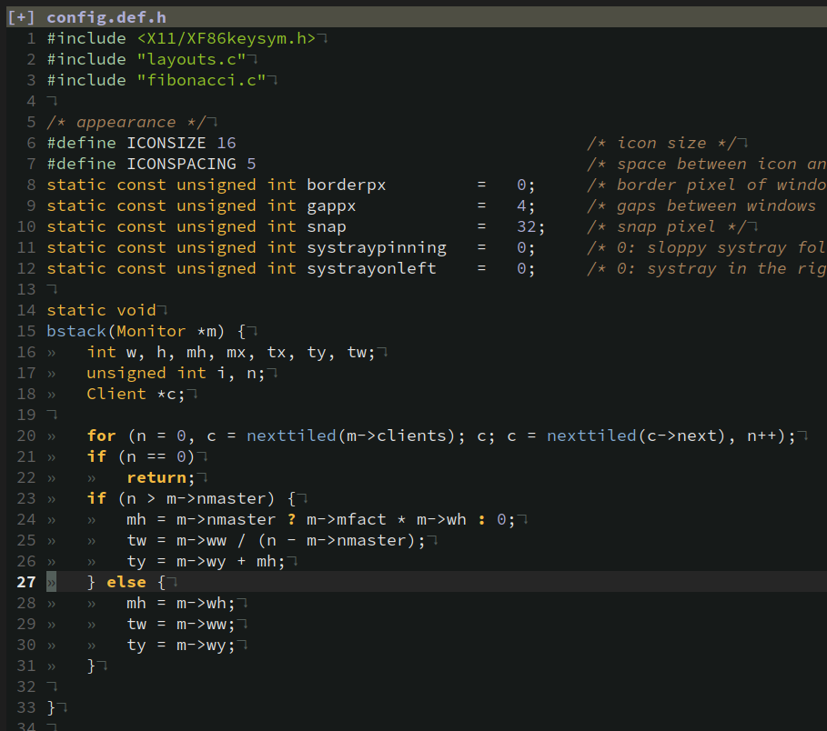

### scruber.vim



My **"fork"** of [gruber.vim](https://gitlab.com/madyanov/gruber.vim)

### Installing

- Packer
```lua
use 'aditya-K2/scruber.vim'
```

#### Applying Colorscheme

```vim
colorscheme scruber
```
